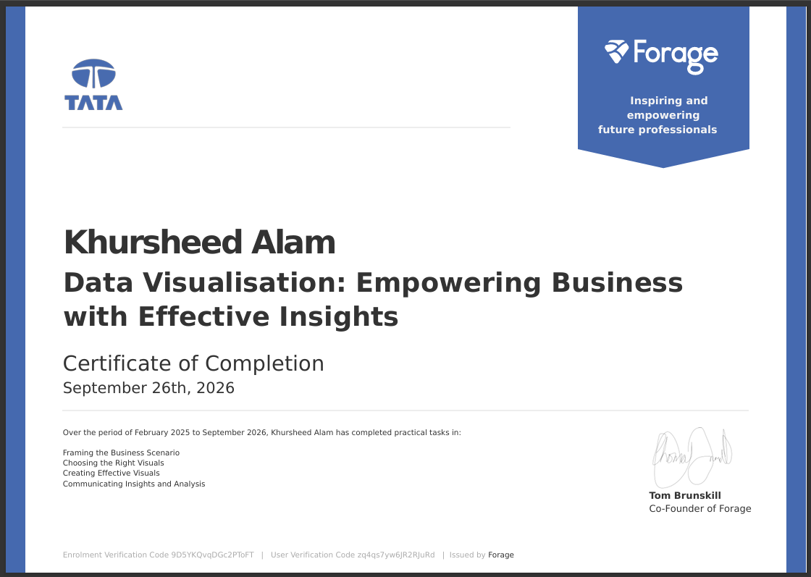
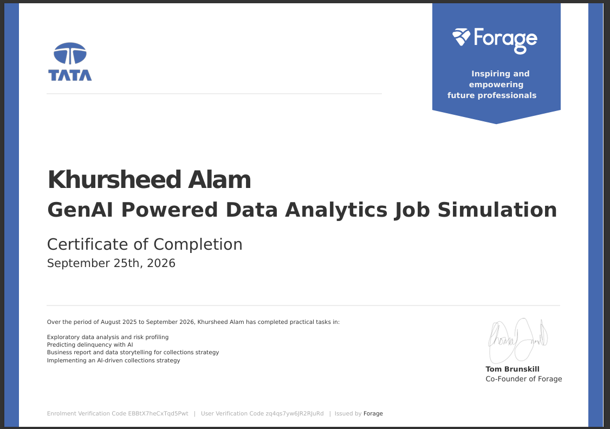
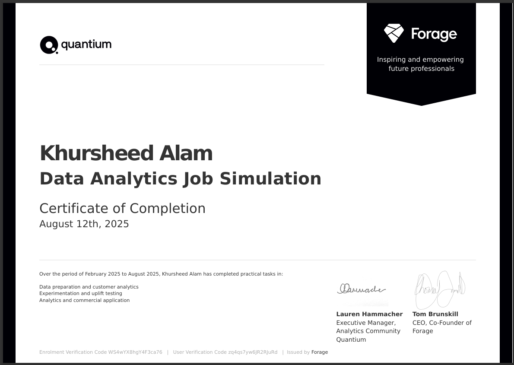

# 📊 Data Analysis & Business Intelligence Portfolio

A curated collection of end-to-end Data Analytics, Machine Learning, and Business Intelligence projects covering web scraping, data ETL pipelines, data modeling (Star Schema), DAX calculations, and interactive Power BI dashboards.

---

## 📜 Certifications & Job Simulations

<table>
  <tr>
    <td align="center" width="33%">
        
      <b>Tata - Data Visualisation</b> 
      Empowering Business with Effective Insights 
      <small><i>Issued by Tata & Forage (Sep 2026)</i></small>
    </td>
    <td align="center" width="33%">
        
      <b>Tata - GenAI Data Analytics</b> 
      GenAI Powered Data Analytics Job Simulation 
      <small><i>Issued by Tata & Forage (Sep 2026)</i></small>
    </td>
    <td align="center" width="33%">
        
      <b>Quantium - Data Analytics</b> 
      Retail Strategy & Customer Analytics 
      <small><i>Issued by Quantium & Forage (Aug 2025)</i></small>
    </td>
  </tr>
</table>

---

## 📁 Featured Projects

| # | Project Name | Tech Stack | Domain / Dataset | Key Highlights |
|---|:---|:---|:---|:---|
| 1 | **[t20Match_Analysis](./t20Match_Analysis)** | Python, Pandas, Power BI, DAX, Power Query | Cricket / T20 World Cup | Best 11 team selection using role-based metric filtering & interactive Power BI dashboard |

---

## 🛠️ Global Tech Stack
- **Languages & Libraries:** Python (`Pandas`, `NumPy`, `Requests`, `JSON`)
- **Analytics & BI Tools:** Microsoft Power BI, DAX, Power Query, Excel
- **Notebooks & Environments:** Jupyter Notebook, VS Code
- **Version Control & Collaboration:** Git & GitHub

---

## 👤 Author & Connect
- **Developer:** [Khursheed Alam](https://khursheed4k.vercel.app) 🚀
- **Portfolio:** [khursheed4k.vercel.app](https://khursheed4k.vercel.app)
- **GitHub:** [@Khursheed5898](https://github.com/Khursheed5898)
